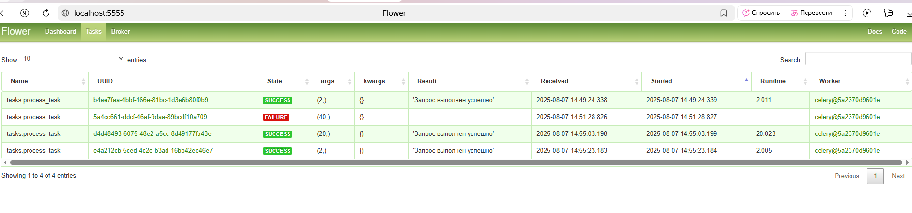
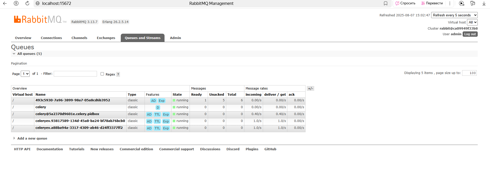

# Celery + RabbitMQ + FastAPI Task Processing System

## Описание проекта

Этот проект представляет собой систему обработки задач с использованием:
- FastAPI для веб-интерфейса
- Celery для асинхронной обработки задач
- RabbitMQ в качестве брокера сообщений
- Redis для хранения результатов
- Flower для мониторинга задач

## Основные компоненты

1. **FastAPI приложение** (`main.py`) - предоставляет API для отправки задач
2. **Celery worker** (`celery_app.py`, `tasks.py`) - обрабатывает задачи асинхронно
3. **RabbitMQ** - брокер сообщений для Celery
4. **Redis** - хранилище результатов выполнения задач
5. **Flower** - веб-интерфейс для мониторинга Celery

## Функциональность

- Асинхронная обработка задач с произвольным временем выполнения 
- Отслеживание прогресса выполнения задач
- Обработка ошибок и таймаутов
- Мониторинг через Flower

## Сервисы

Сервисы будут доступны по следующим адресам:

- FastAPI: http://localhost:8000

- Flower (мониторинг): http://localhost:5555

- RabbitMQ management: http://localhost:15672 

### FastAPI 
Пример запроса:
delay - время для имитации работы 
```json
{
  "delay": 2 
}
```
Ответ:
```json
{
  "status": "completed",
  "result": "Запрос выполнен успешно",
  "time": 2.51564884185791
}
```

Запрос:
```json
{
  "delay": 40
}
```
Ответ:
```json
{
  "status": "pending",
  "message": "Пока не можем обработать ваш запрос, попробуйте позже",
  "time": 30.13848066329956
}
```

При отправке нескольких запросов, один будет выполняться, а остальные будут в очереди

Запрос 1
```json
{
  "delay": 20
}
```
Запрос 2:
```json
{
  "delay": 2
}
```
Ответ для запроса 1:
```json
{
  "status": "completed",
  "result": "Запрос выполнен успешно",
  "time": 20.044792890548706
}
```
Ответ за запрос 2:
```json
{
  "status": "completed",
  "result": "Запрос выполнен успешно",
  "time": 20.04340434074402
}
```
Из ответа на запрос 2 видно, что время выполнения составило более 20 сек, т.е. учитывалось время нахождения в очереди

### Flower 
Представляет собой интерфейс для отслеживания выполненных или выполняющихся задач


Можно отследить 
- статус задачи (State)
- время создания (Received)
- время выполнения (Runtime)
- воркер, которые обрабатывает задачу (Worker)


### RabbitMQ management 
Представляет собой интерфейс для отслеживания поступивших задач в очереди


| Название очереди                          | Назначение                                                                 |
|-------------------------------------------|----------------------------------------------------------------------------|
| `celery`                                  | Основная очередь для задач Celery (все задачи по умолчанию)                |
| `celery@<hostname>.celery.pidbox`         | Управление воркерами (перезапуск, мониторинг)                              |
| `celeryev.<UUID>`                         | Мониторинг выполнения задач в Flower (режим реального времени)             |
| `celeryev.<UUID>` (второй экземпляр)      | Дублирование для отказоустойчивости Flower                                 |
| `<UUID>` (например `486634d7-...`)        | Временная очередь для RPC-ответов (при `backend='rpc://'`)                 |


## Настройки
Основные настройки находятся в settings/constants.py:

- TASK_TIMEOUT - максимальное время выполнения задачи

- worker_concurrency - кол-во процессов (воркеров)

- RABBITMQ_HOST - хост RabbitMQ
- RABBITMQ_DEFAULT_USER - user RabbitMQ
- RABBITMQ_DEFAULT_PASS - пароль RabbitMQ

- PORT_AMQP - порт RabbitMQ, который используется для :
  - Обмена сообщениями между клиентами (Celery workers, FastAPI) и RabbitMQ
  - Прием/отправка задач в очереди
  - Рабочий порт для Celery брокера
  
- PORT_WEB - порт RabbitMQ для доступа к веб-панели управления RabbitMQ


## Установка и запуск
```bash
git clone https://github.com/svetlana-terzeman/RabbitMQ_Template
cd RabbitMQ_Template
docker compose build 
docker compose up   
```
